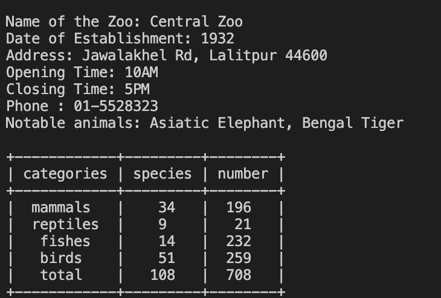
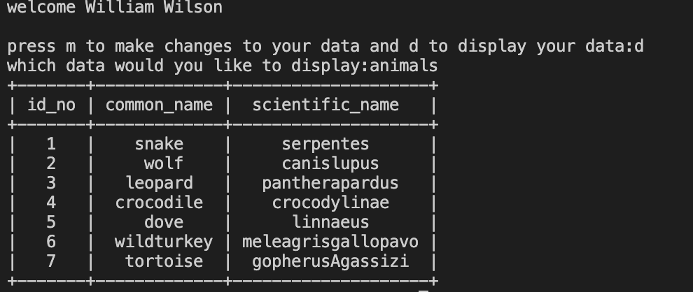

# ZPMS (Zoological Park Management System)

This is a Zoological Park Management System used for managing, monitoring and controlling the system in a Zoological Park. This application is developed using python, which mainly focuses on basic operations in a zoo like adding new animal information, and updating new information. 

This application only uses one library. The ```PrettyTable``` library.
User-Interface for the application is not developed. It is run in CLI.

## Screen Shots

### Details


### Animal Details



## Features
1. Display the available data.
2. Make changes to the available data. 
3. Append more data to the available data. 

## How to Use?

To run the application, enter the src folder and run ```app.py```. 

```
UserName = admin
Email = admin@zoo.com
Password = root
```

